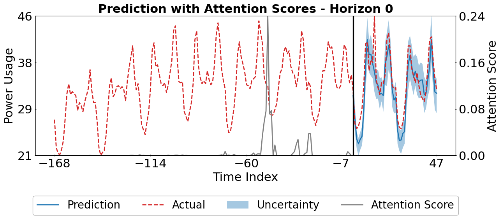
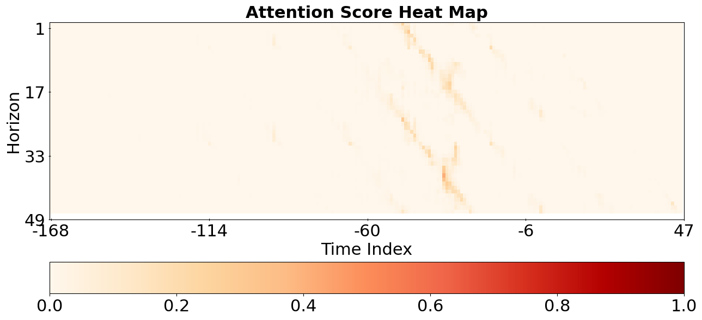

# Transformer Temporal Fusion
Pytorch implementation of [Transformer Temporal Fusion](https://ai.googleblog.com/2021/12/interpretable-deep-learning-for-time.html) (TFT) for time series forecast. 
This implementation, adapted from the referenced repository [pytorch-forecasting](https://pytorch-forecasting.readthedocs.io/en/stable/index.html)
, simplified for developers outside the computer science field.
## Installation
### Create Miniconda Environment
We recommend installing miniconda for managing Python environment, yet this repo works well with other alternatives e.g., `venv`.
1. Install miniconda by following these [instructions](https://docs.conda.io/projects/conda/en/latest/user-guide/install/index.html#system-requirements) 
2. Create a conda environment
    ```
    conda create --name your_env_name python=3.10
    ```
3. Activate conda environment
    ```
    conda activate your_env_name
    ```
### Install all required libraries
```shell
pip install -r requirements.txt
```

### Download Example Data
Either run the following command to download the data or directly visit the provided URL

```shell
wget https://archive.ics.uci.edu/ml/machine-learning-databases/00321/LD2011_2014.txt.zip
unzip LD2011_2014.txt.zip
```
### Train TFT Model
```shell
python runner.py
```

### Power Usage Prediction
<p align="center">
  
</p>

### Prediction Interpretation
<p align="center" style="margin-top: 20px;">
  
  &nbsp;&nbsp;&nbsp;&nbsp;&nbsp;&nbsp;&nbsp;&nbsp;&nbsp;&nbsp;
  
  
</p>

<p align="center" style="margin-top: 20px;">
  
  &nbsp;&nbsp;&nbsp;&nbsp;&nbsp;&nbsp;&nbsp;&nbsp;&nbsp;&nbsp;
  
</p>


## Directory Structure
```
.
├── runner.py                         # Run the training step
├── config                            # User-specified data variables and hyperparameters for TFT
├── data_preprocessor.py              # Preprocess data for TFT format
├── metric.py                         # Loss function for training e.g., Quantile loss
├── model.py                          # All model architectures required for TFT 
├── tft.py                            # TFT model
├── tft_interp.py                     # Output interpretation and visual tools

```


## License 

This implementation is released under the MIT license. 

**THIS IS AN OPEN SOURCE SOFTWARE FOR RESEARCH PURPOSES ONLY. THIS IS NOT A PRODUCT. NO WARRANTY EXPRESSED OR IMPLIED.**

## Acknowledgement
This code is adapted from the repository [pytorch-forecasting](https://pytorch-forecasting.readthedocs.io/en/stable/index.html).
In addition, we would like to acknowledge and give credit to UC Irvine Machine Learning Repository for 
providing the sample dataset that we utilized for this project.
